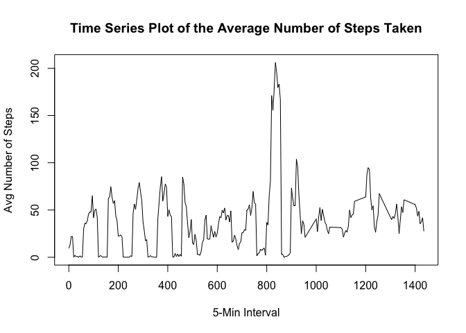
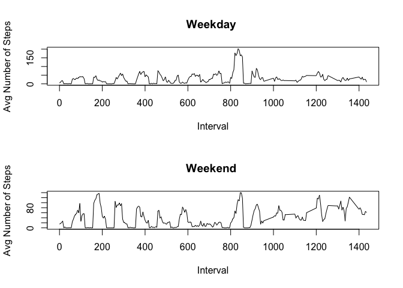

## Import library


```r
library(dplyr)
```

```
## 
## Attaching package: 'dplyr'
```

```
## The following objects are masked from 'package:stats':
## 
##     filter, lag
```

```
## The following objects are masked from 'package:base':
## 
##     intersect, setdiff, setequal, union
```

## Loading and preprocessing the data

```r
activity <- read.csv("activity.csv")
```

## What is mean total number of steps taken per day?
####1 Make a histogram of the total number of steps taken each day

```r
daily_data <- aggregate(activity$steps, by = list(date = activity$date), FUN = sum)
daily_data <- na.omit(daily_data)  # Calculate total # of steps taken per day
hist(as.numeric(daily_data$x), 
     main = "Histogram of Total Number of Steps per Day",
     xlab = "Total Number of Steps",
     ylab = "Frequency",
     breaks = 5)  # Make a histogram of total # of steps per day
```

<!-- -->

####2 Calculate and report the mean and median total number of steps taken per day

```r
mean <- sum(daily_data$x)/nrow(daily_data)
mean
```

```
## [1] 10766.19
```

```r
median <- median(daily_data$x)
median
```

```
## [1] 10765
```

## What is the average daily activity pattern?
####1 Make a time series plot (i.e. type = "l") of the 5-minute interval (x-axis) and the average number of steps taken, averaged across all days (y-axis)

```r
activity$adjusted_interval <- activity$interval %% (5*12*24) #add adjusted interval col
adj_daily_data <- aggregate(activity$steps, by = list(adj_interval = activity$adjusted_interval), 
                            FUN = mean, na.rm = TRUE)
plot(adj_daily_data$adj_interval, as.numeric(adj_daily_data$x), type = "l",
     xlab = "5-Min Interval", ylab = "Avg Number of Steps",
     main = "Time Series Plot of the Average Number of Steps Taken")
```

<!-- -->

###2 Which 5-minute interval, on average across all the days in the dataset, contains the maximum number of steps?

```r
max_interval <- adj_daily_data[which.max(adj_daily_data$x),1]
```

## Imputing missing values
####1 Calculate and report the total number of missing values in the dataset (i.e. the total number of rows with NAs)

```r
isTrue <- is.na(activity$steps)
length(isTrue[isTrue == TRUE]) 
```

```
## [1] 2304
```

####2 Devise a strategy for filling in all of the missing values in the dataset. The strategy does not need to be sophisticated. For example, you could use the mean/median for that day, or the mean for that 5-minute interval, etc.

```r
# filling NAs with mean of that day
new_data <- data.frame("steps" = activity$steps,"date" = activity$date)
new_data$steps[is.na(new_data$steps)] <- 0 # fill NAs with 0
daily_average <- aggregate(new_data$steps, by = list(date = new_data$date), 
                                    FUN = mean) # calculate average steps per day
avg_steps <- rep(daily_average$x,each = 288) # construct new col with daily average steps
activity$avg_steps <- avg_steps
for (i in 1:nrow(activity)) {
  if(is.na(activity$steps[i])) {
    activity$steps[i] <- activity$avg_steps[i]
  }
} # fill missing data with average steps of the day
```

####3 Create a new dataset that is equal to the original dataset but with the missing data filled in.

```r
new_activity <- activity
```

####4 Make a histogram of the total number of steps taken each day and Calculate and report the mean and median total number of steps taken per day. Do these values differ from the estimates from the first part of the assignment? What is the impact of imputing missing data on the estimates of the total daily number of steps?

```r
# group new dataset by date
new_daily_data <- aggregate(new_activity$steps, by = list(date = new_activity$date), FUN = sum)
hist(as.numeric(new_daily_data$x), 
     main = "Histogram of Total Number of Steps per Day (NAs filled in)",
     xlab = "Total Number of Steps",
     ylab = "Frequency",
     breaks = 5)
```

<!-- -->

```r
new_mean <- sum(new_daily_data$x)/nrow(new_daily_data)
new_mean
```

```
## [1] 9354.23
```

```r
new_median <- median(new_daily_data$x)
new_median
```

```
## [1] 10395
```

## Are there differences in activity patterns between weekdays and weekends?
####1 Create a new factor variable in the dataset with two levels -- "weekday" and "weekend" indicating whether a given date is a weekday or weekend day.

```r
new_activity <- new_activity[, 1:5]
# determine weekday or weekend
days <- weekdays((as.Date(new_activity$date)))
for (i in 1:length(days)) {
  if(days[i] == "Saturday" | days[i] == "Sunday"){
    days[i] <- "weekend"
  }else{
    days[i] <- "weekday"
  }
}
new_activity$days <- days # add days col to dataset
```

####2 Make a panel plot containing a time series plot (i.e. type = "l") of the 5-minute interval (x-axis) and the average number of steps taken, averaged across all weekday days or weekend days (y-axis). 

```r
# split dataset to weekday data and weekend data
weekday_data <- new_activity[new_activity$days == "weekday", ]
weekend_data <- new_activity[new_activity$days == "weekend", ]
# group by average # of steps by intervals for weekday and weekend 
weekday_interval <- aggregate(weekday_data$steps, by = list(interval = weekday_data$adjusted_interval), 
                       FUN = mean)
weekend_interval <- aggregate(weekend_data$steps, by = list(interval = weekend_data$adjusted_interval), 
                              FUN = mean)
# make panel graph containing time series plot(interval vs. avg # cross all weekdays/weekends)
par(mfrow = c(2,1))
plot(weekday_interval$interval, as.numeric(weekday_interval$x), type = "l",
     xlab = "Interval", ylab = "Avg Number of Steps",
     main = "Weekday ")
plot(weekend_interval$interval, as.numeric(weekend_interval$x), type = "l",
     xlab = "Interval", ylab = "Avg Number of Steps",
     main = "Weekend ")
```

<!-- -->
